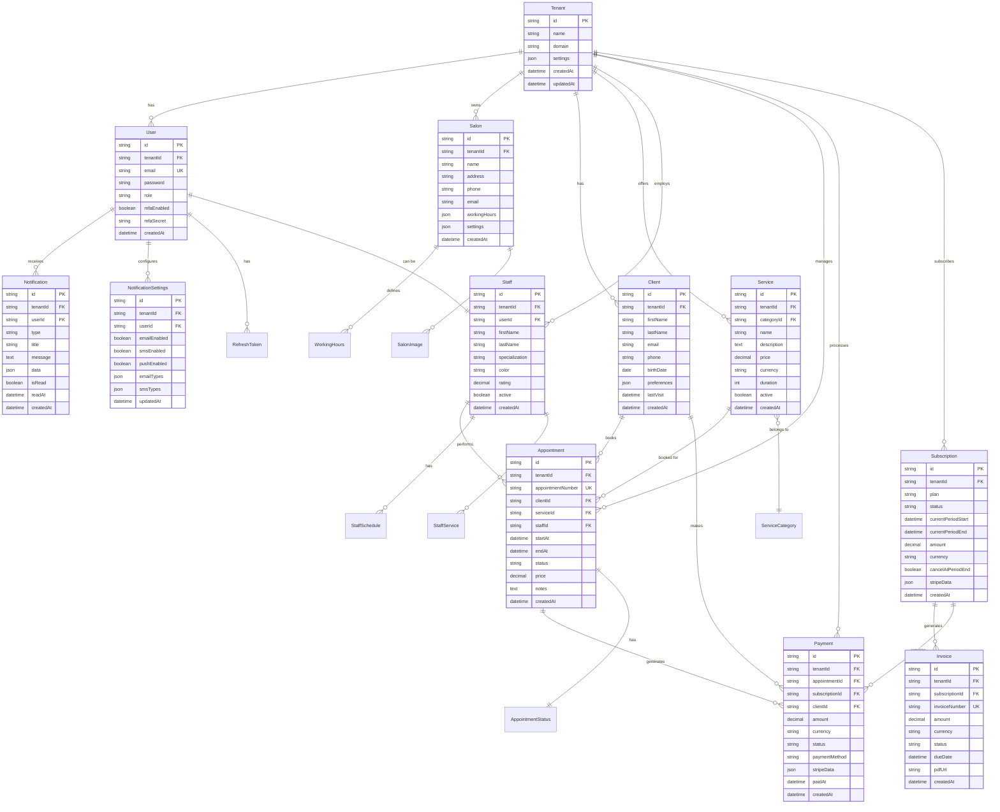

# 🗄️ Database Entity Relationship Diagram

## Overview
Beauty Platform использует PostgreSQL с multi-tenant архитектурой. Каждый салон (tenant) имеет изолированные данные.

## ERD Diagram



## Key Relationships

### Multi-Tenant Architecture
- **ВСЕГДА** используется `tenantId` для изоляции данных
- Каждая таблица (кроме системных) содержит `tenantId`
- Доступ через `tenantPrisma(tenantId)` helper

### Core Relationships
1. **Tenant → User**: Один tenant может иметь много пользователей
2. **User → Staff**: Пользователь может быть сотрудником
3. **Client → Appointment → Service/Staff**: Клиент бронирует услугу у мастера
4. **Appointment → Payment**: Запись генерирует платеж
5. **Subscription → Invoice → Payment**: Подписка генерирует счета

### Security Constraints
- Уникальность email в рамках tenant
- Уникальность appointment number глобально
- Cascade delete для зависимых записей
- Soft delete для критических данных (clients, appointments)

## Indexes

### Performance Optimization
```sql
-- Tenant isolation
CREATE INDEX idx_tenant ON all_tables(tenantId);

-- Authentication
CREATE UNIQUE INDEX idx_user_email ON users(tenantId, email);
CREATE INDEX idx_refresh_token ON refresh_tokens(token, userId);

-- Appointments
CREATE INDEX idx_appointment_date ON appointments(tenantId, startAt);
CREATE INDEX idx_appointment_staff ON appointments(tenantId, staffId, startAt);
CREATE INDEX idx_appointment_client ON appointments(tenantId, clientId);

-- Payments
CREATE INDEX idx_payment_status ON payments(tenantId, status, createdAt);
CREATE INDEX idx_payment_stripe ON payments(stripePaymentIntentId);

-- Notifications
CREATE INDEX idx_notification_unread ON notifications(tenantId, userId, isRead);
```

## Migration Strategy

### Prisma Migrations
```bash
# Generate migration
npx prisma migrate dev --name add_feature_name

# Apply migrations
npx prisma migrate deploy

# Reset database (development only)
npx prisma migrate reset
```

### Seed Data
```bash
# Run seed script
npx prisma db seed
```

## Data Types Mapping

| PostgreSQL | Prisma | TypeScript |
|------------|--------|------------|
| UUID | String | string |
| TEXT | String | string |
| DECIMAL | Decimal | number |
| TIMESTAMP | DateTime | Date |
| JSON | Json | any/object |
| BOOLEAN | Boolean | boolean |
| INTEGER | Int | number |

## Best Practices

1. **Always use transactions** for multi-table operations
2. **Implement soft delete** for audit trail
3. **Use UUID** for primary keys
4. **Add indexes** for foreign keys and frequently queried fields
5. **Regular backups** with point-in-time recovery
6. **Monitor query performance** with EXPLAIN ANALYZE

---

*Last updated: 2025-01-21*