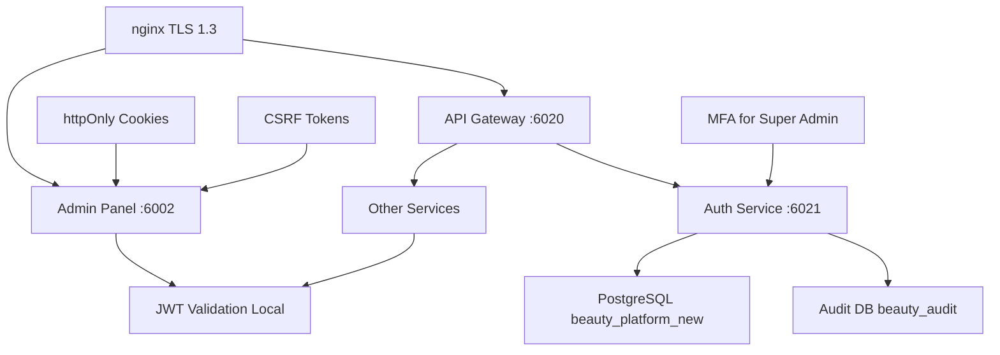

# 🔐 Beauty Platform Security Documentation

> **Enterprise Security Standards 2024** - Полная документация по безопасности проекта

---

## 📚 **ДОКУМЕНТЫ В ЭТОЙ ПАПКЕ**

### **🎯 Для разработчиков:**

1. **[ADMIN_PANEL_SECURITY_GUIDE.md](./ADMIN_PANEL_SECURITY_GUIDE.md)**
   - 🔒 Полное руководство по безопасности админ-панели
   - ❌ Что нельзя делать (критичные ошибки)
   - ✅ Правильная реализация (enterprise уровень)
   - 🛡️ httpOnly cookies, CSRF protection, MFA
   - 📊 Audit system и мониторинг

2. **[JWT_IMPLEMENTATION_GUIDE.md](./JWT_IMPLEMENTATION_GUIDE.md)**
   - 🔑 Пошаговая реализация JWT аутентификации
   - 🏗️ Централизованная архитектура
   - 🛠️ Код для Auth Service и клиентов
   - 🧪 Тестирование и troubleshooting
   - 📋 Deployment checklist

---

## 🚨 **КРИТИЧНО ВАЖНО**

### **⚠️ ОБЯЗАТЕЛЬНО ПРОЧИТАЙ ПЕРЕД РАБОТОЙ:**

```
❌ НЕ ИСПОЛЬЗУЙ localStorage для токенов
❌ НЕ ДЕЛАЙ запросы без credentials: 'include'
❌ НЕ СОЗДАВАЙ JWT с слабыми секретами (<64 символов)
❌ НЕ ЗАБЫВАЙ проверять роли и разрешения
❌ НЕ ИГНОРИРУЙ CSRF protection
```

```
✅ ИСПОЛЬЗУЙ httpOnly cookies
✅ ВАЛИДИРУЙ JWT с полными проверками
✅ ПРИМЕНЯЙ tenant isolation везде
✅ ЛОГИРУЙ все админские действия
✅ НАСТРОЙ MFA для Super Admin
```

---

## 🏗️ **SECURITY ARCHITECTURE**

### **Централизованная аутентификация:**



### **Security Layers:**

1. **🌐 Network Security**: TLS 1.3, Security Headers, Rate Limiting
2. **🔐 Authentication**: JWT + httpOnly cookies + MFA
3. **🛡️ Authorization**: RBAC + Permissions + Tenant Isolation
4. **📊 Monitoring**: Comprehensive Audit + Real-time Alerts
5. **🔒 Data Protection**: Encryption + GDPR Compliance

---

## 📋 **SECURITY CHECKLIST**

### **🔥 КРИТИЧНЫЕ ЗАДАЧИ (Реализовать немедленно):**

- [ ] **Replace localStorage with httpOnly cookies**
  - [ ] Update AuthContext in all apps
  - [ ] Configure CORS with credentials: 'include'
  - [ ] Test cookie behavior in production

- [ ] **Implement full JWT validation**
  - [ ] Create JWTService with proper validation
  - [ ] Check iss, aud, alg in all services
  - [ ] Add clockTolerance for time sync

- [ ] **Setup CSRF protection**
  - [ ] Install csurf middleware
  - [ ] Create /csrf-token endpoint
  - [ ] Update all forms with CSRF tokens

- [ ] **Add MFA for Super Admin**
  - [ ] Install speakeasy + qrcode
  - [ ] Create MFA setup/verify endpoints
  - [ ] Force MFA for admin operations
  - [ ] Generate backup codes

- [ ] **Create audit system**
  - [ ] Setup separate beauty_audit database
  - [ ] Implement auditLogger middleware
  - [ ] Log all admin actions
  - [ ] Setup log retention policy

### **⚠️ ВАЖНЫЕ ЗАДАЧИ (В течение недели):**

- [ ] **Security Headers & CSP**
  - [ ] Update nginx configuration
  - [ ] Add strict Content Security Policy
  - [ ] Configure HSTS headers

- [ ] **Rate Limiting & DDoS Protection**
  - [ ] Setup nginx rate limiting
  - [ ] Add express-rate-limit
  - [ ] Monitor suspicious activity

- [ ] **Monitoring & Alerting**
  - [ ] Log security events
  - [ ] Setup alerts for audit anomalies
  - [ ] Create security metrics dashboard

---

## 🛠️ **IMPLEMENTATION ORDER**

### **Phase 1: Critical Security (1-2 дня)**
1. Replace localStorage → httpOnly cookies
2. Add full JWT validation
3. Setup CSRF protection

### **Phase 2: Enterprise Features (3-5 дней)**
4. Implement MFA for Super Admin
5. Create comprehensive audit system
6. Setup security monitoring

### **Phase 3: Advanced Security (1-2 недели)**
7. Advanced rate limiting
8. Security headers optimization
9. Compliance features (GDPR)

---

## 🚀 **QUICK START**

### **1. Прочитай документацию:**
```bash
# Основные гайды
cat docs/security/ADMIN_PANEL_SECURITY_GUIDE.md
cat docs/security/JWT_IMPLEMENTATION_GUIDE.md
```

### **2. Проверь текущее состояние:**
```bash
# Проверь что используется localStorage (нужно заменить)
grep -r "localStorage" apps/admin-panel/src/

# Проверь JWT секреты
echo $JWT_SECRET | wc -c  # Должно быть >64
```

### **3. Начни с критичных исправлений:**
```bash
# Установи зависимости для security
pnpm add jsonwebtoken speakeasy qrcode csurf express-rate-limit
pnpm add -D @types/jsonwebtoken @types/speakeasy @types/qrcode
```

---

## 📞 **ПОДДЕРЖКА**

### **🆘 Если что-то не работает:**

1. **Проверь логи Auth Service:**
   ```bash
   tail -f /var/log/beauty-platform/auth-service.log
   ```

2. **Проверь cookies в браузере:**
   - F12 → Application → Cookies
   - Должны быть beauty_access_token и beauty_refresh_token
   - HttpOnly ✅, Secure ✅, SameSite: Strict ✅

3. **Проверь CORS:**
   ```bash
   curl -X OPTIONS https://auth.beauty.designcorp.eu/auth/login \
     -H "Origin: https://test-admin.beauty.designcorp.eu" \
     -v
   ```

### **📧 Контакты:**
- **Security Team**: beauty-security@designcorp.eu
- **Emergency**: security-incidents@designcorp.eu

---

## 🎯 **ЦЕЛЬ БЕЗОПАСНОСТИ**

### **✅ После реализации всех мер:**

- 🔒 **Zero XSS Risk** - httpOnly cookies + строгий CSP
- 🛡️ **CSRF Protection** - двойная защита tokens + cookies  
- 🔐 **Strong Authentication** - JWT + MFA для админов
- 📊 **Full Audit Trail** - все действия записываются
- ⚡ **High Performance** - локальная валидация JWT
- 🎯 **Enterprise Grade** - соответствие стандартам 2024

---

**🛡️ BEAUTY PLATFORM = ENTERPRISE SECURITY** 🔐

*Last updated: 2025-08-12*